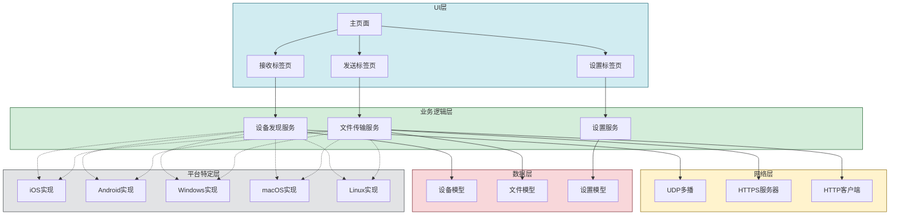
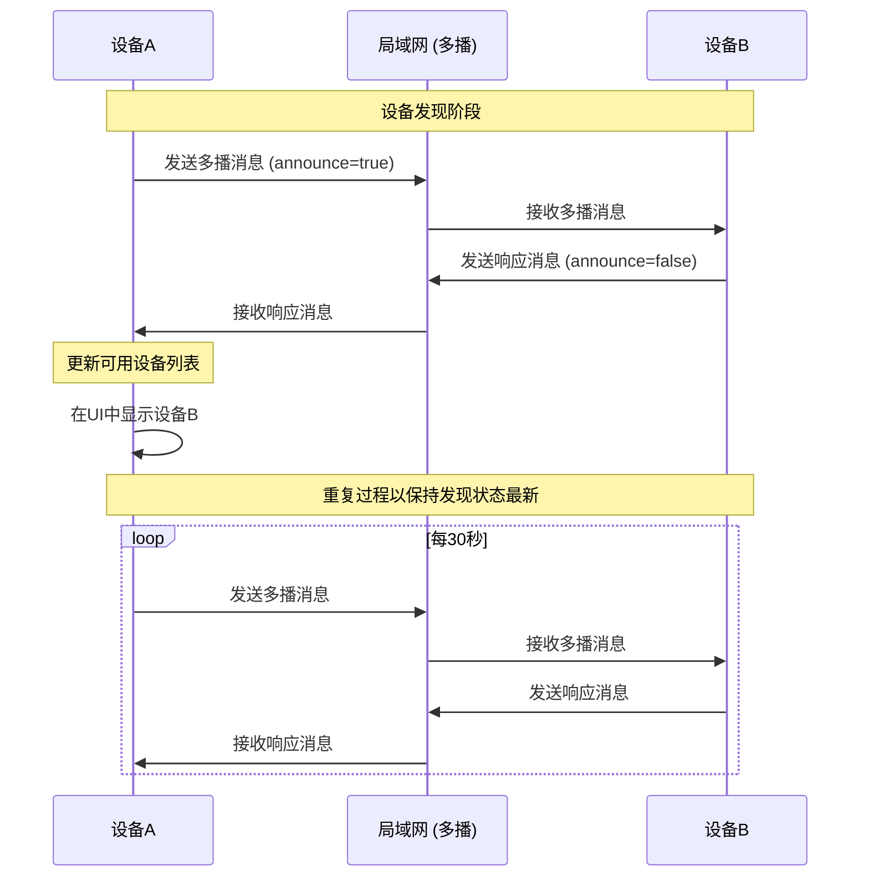
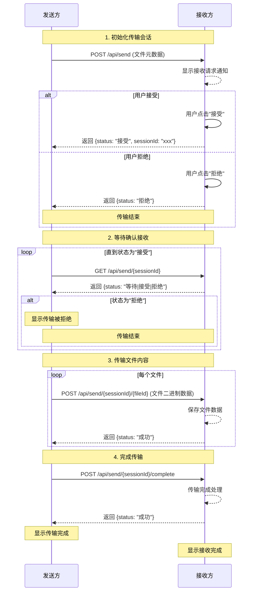
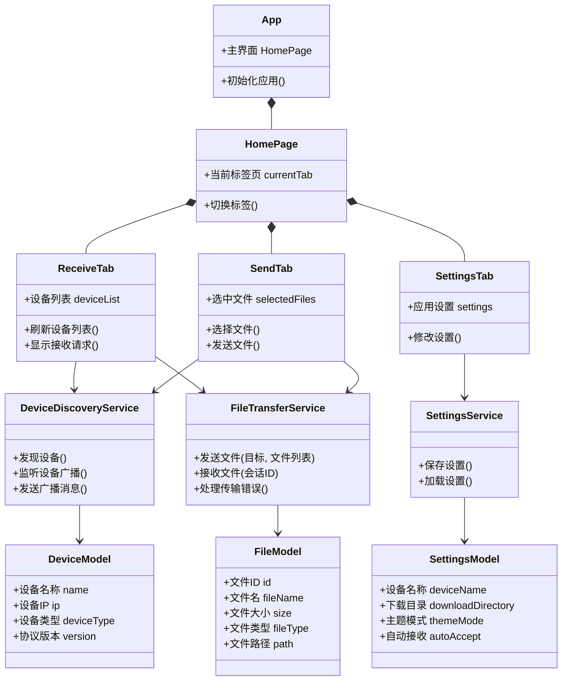
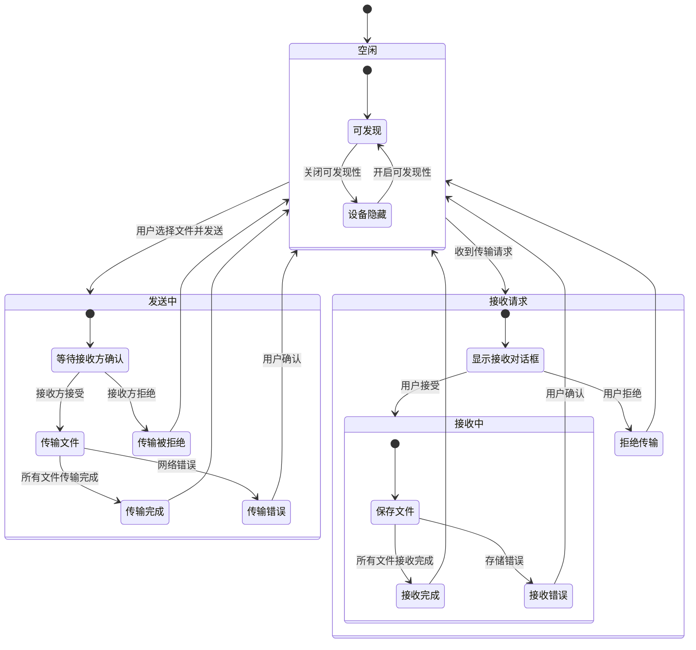
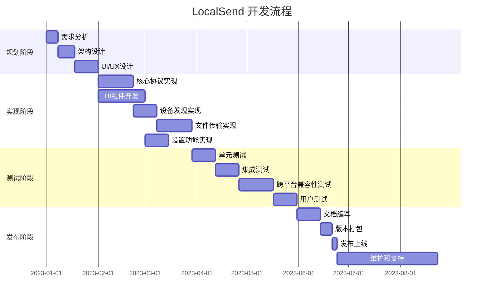
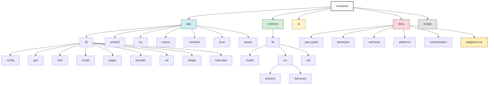
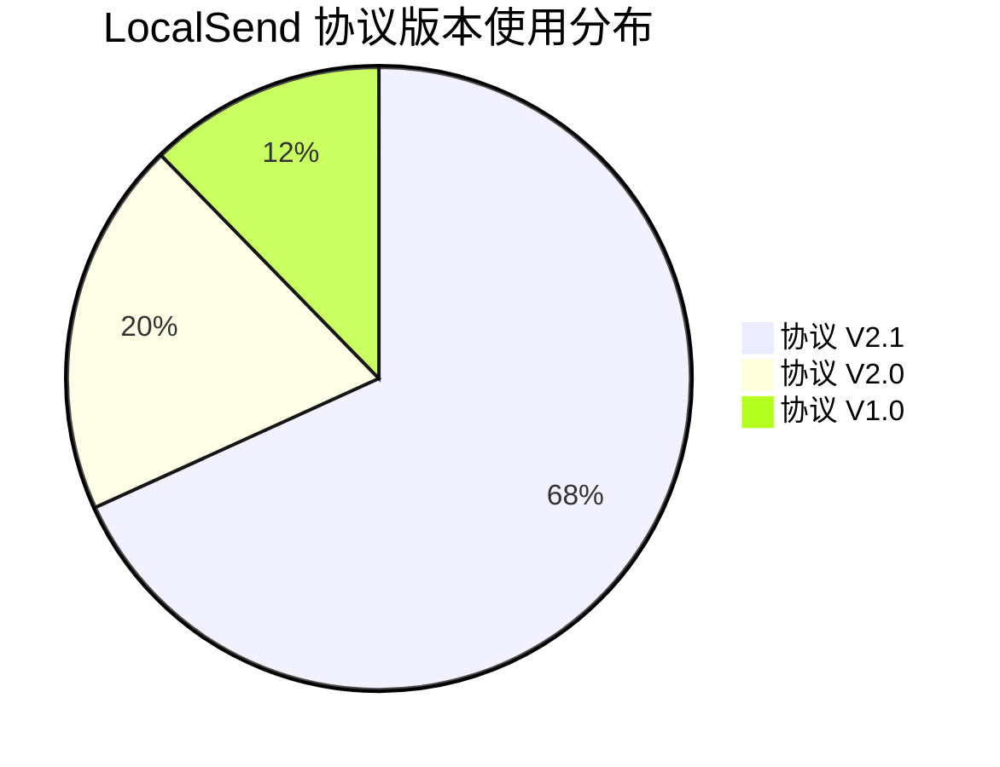

# LocalSend 架构与流程图表

本文档使用 Mermaid 图表来可视化展示 LocalSend 的架构、组件关系和工作流程。所有图表均遵循 mermaid.live 标准。

## 目录

- [整体架构](#整体架构)
- [设备发现流程](#设备发现流程)
- [文件传输流程](#文件传输流程)
- [组件关系](#组件关系)
- [应用状态转换](#应用状态转换)
- [开发流程](#开发流程)
- [项目结构](#项目结构)

## 整体架构

下图展示了 LocalSend 的整体架构，包括主要组件和它们之间的关系：



## 设备发现流程

下面的序列图描述了设备发现的完整流程：



## 文件传输流程

以下图表展示了完整的文件传输流程：



## 组件关系

下面的类图展示了 LocalSend 主要组件之间的关系：



## 应用状态转换

下面的状态图展示了 LocalSend 应用在文件传输过程中的状态转换：



## 开发流程

下面的甘特图展示了 LocalSend 的典型开发流程：



## 项目结构

下面的树图展示了 LocalSend 项目的目录结构：



## 饼图：协议使用统计

以下饼图展示了 LocalSend 协议版本的使用分布：



## 象限图：功能优先级

```mermaid
quadrantChart
    title "功能优先级矩阵"
    x-axis "实现难度" "低" --> "高"
    y-axis "用户价值" "低" --> "高"
    quadrant-1 "优先实现"
    quadrant-2 "计划实现"
    quadrant-3 "可选实现"
    quadrant-4 "谨慎评估"
    "文件传输": [0.2, 0.9]
    "设备发现": [0.3, 0.8]
    "文件夹传输": [0.5, 0.7]
    "加密传输": [0.6, 0.8]
    "断点续传": [0.7, 0.6]
    "远程传输": [0.9, 0.5]
    "历史记录": [0.4, 0.4]
    "传输压缩": [0.7, 0.4]
    "自动接收": [0.3, 0.3]
    "主题定制": [0.2, 0.3]
    "断点续传": [0.7, 0.6]
    "远程传输": [0.9, 0.5]
    "历史记录": [0.4, 0.4]
    "传输压缩": [0.7, 0.4]
    "自动接收": [0.3, 0.3]
    "主题定制": [0.2, 0.3]
```
